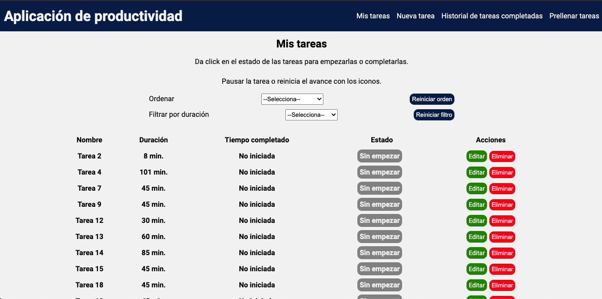

# 💻 Ejercicio Prueba Tecnica

Este proyecto es un ejercicio para una prueba técnica. Crea tareas con su duracion (corta, media, larga o personalizada), empiezalas, pausalas o reinicialas. Puedes editar o eliminar tareas. Existe un resumen de tus tareas terminadas en la semana actual. Evita la tediosa tarea de llenar datos con la opciones de "Prellenar tareas" con 50 tareas aleatorias para ver los resultados. Los datos se guardan en memoria por lo que al recargar se perderán.



## 🛠 Scripts

```bash
# Instalar dependencias
$ npm install

# Encender servidor de desarrollo en localhost:3000
$ npm start

# Crear version de producción y lanzar el servidor
$ npm run build

```

## 💎 Tecnologías

- ReactJS
- React Hooks
- Styled components
- Recharts

## 💣 Despliegue

https://blissful-allen-8b00b9.netlify.app/ (Todos los cambios se guardan en memoria)
